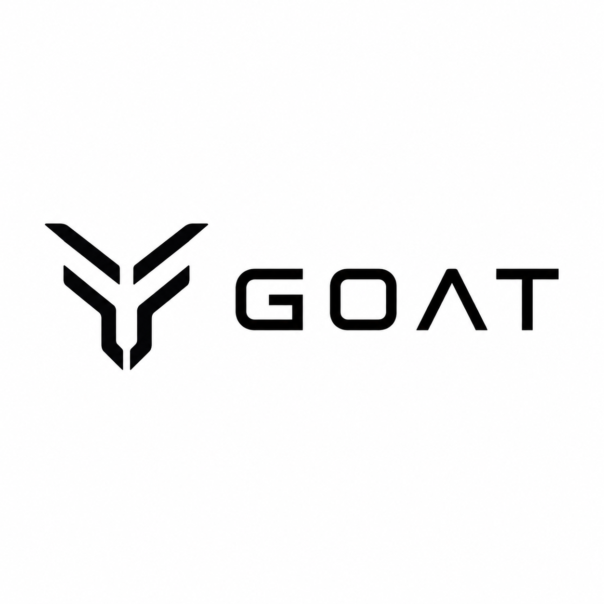
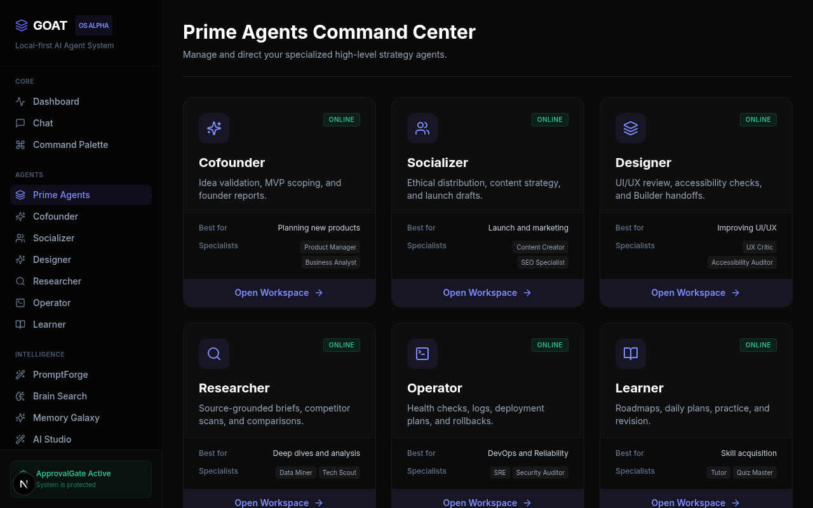
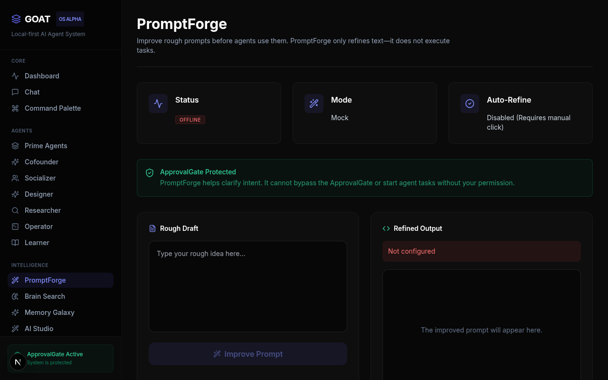
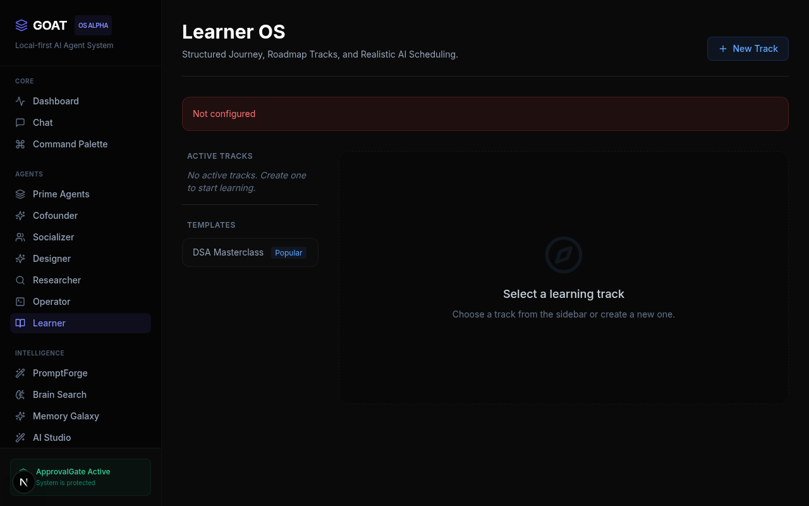
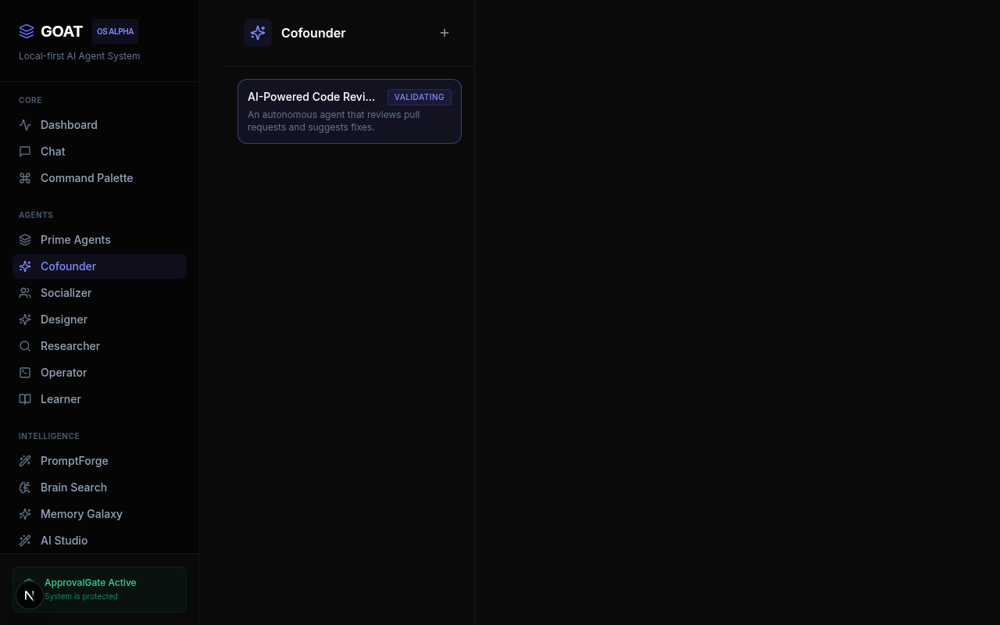
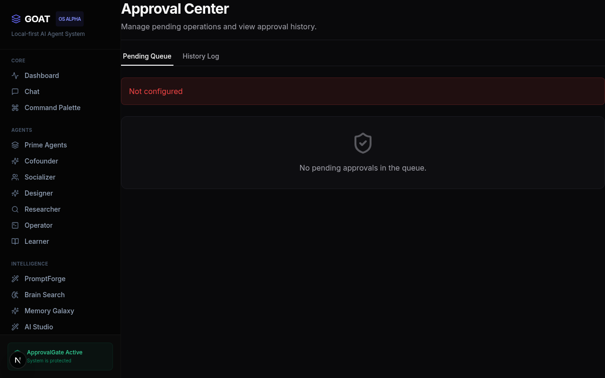

<div align="center">
  
  <h1>GOAT</h1>
  <p><strong>The local-first AI Agent OS for building, learning, research, automation, and safe multi-agent workflows.</strong></p>

  GOAT brings together local AI agents, memory, tools, workflows, dashboards, desktop automation, and safety controls into one inspectable system. It is designed for people who want AI help not only for coding, but also for planning products, learning skills, researching ideas, designing interfaces, launching projects, and operating systems safely.

  <p>
    <a href="#quick-start">Quick Start</a> •
    <a href="#who-is-goat-for">Audiences</a> •
    <a href="#what-goat-can-do">Features</a> •
    <a href="#architecture-overview">Architecture</a> •
    <a href="#safety-model">Security</a> •
    <a href="docs/README.md">Documentation</a>
  </p>

  
  
  
  
  
  
  
</div>

---

## 👥 Who is GOAT for?

GOAT is for:
* **builders** creating apps, tools, and experiments
* **students** planning DSA, AI/ML, Rust, Web3, and project-based learning
* **founders** validating ideas and planning MVPs
* **creators** planning content, launches, and distribution
* **researchers** comparing tools, competitors, and technologies
* **operators** planning deployments, logs, rollbacks, and reliability
* **developers** who want a local-first coding and automation agent

## 🌟 What GOAT can do

### Prime Agents
GOAT provides specialized agents that own domain-specific strategies:
* **Cofounder** — idea validation, MVP scoping, founder reports
* **Socializer** — ethical distribution, content strategy, launch drafts
* **Designer** — UI/UX review, accessibility checks, Builder handoffs
* **Researcher** — source-grounded briefs, competitor scans, comparisons
* **Operator** — health checks, logs, deployment plans, rollback planning
* **Learner** — roadmaps, daily plans, practice, revision, progress reports
* **Builder** — software implementation, debugging, and testing

### Core System
* **ApprovalGate** — explicitly blocks dangerous external actions until you approve.
* **Memory Galaxy / Brain Search** — a persistent vector search system for long-term project memory.
* **PromptForge** — automated context-refinement and prompt improvements.
* **ToolRegistry / MCP** — run terminal commands, Model Context Protocol (MCP) servers, and recipes.
* **Recipes / Workflows** — pre-packaged automations and repetitive tasks.
* **Timeline** — an organized, chronological record of your projects and actions.
* **Interfaces** — choose how you work: Dashboard, TUI, CLI, Daemon, or Desktop.

### What can I do with GOAT today?
GOAT is a practical tool for orchestrating multi-agent work locally. Right now you can:
* **Plan a learning roadmap**: generate daily plans, practice tasks, and progress reports.
* **Validate a startup idea**: run MVPs through the Cofounder agent and get an actionable scorecard.
* **Research competitors**: gather structured insights through the Researcher agent.
* **Review UI/UX**: have the Designer agent audit aesthetics and accessibility.
* **Plan a launch**: draft distribution strategies via the Socializer agent.
* **Improve prompts**: refine vague inputs into rigorous agent instructions with PromptForge.
* **Generate reports**: document health checks and runbooks using the Operator agent.

## 🛡️ Why local-first?
* **Runs on your machine:** Your code, models (via Ollama), and memory remain under your control.
* **You stay in control:** The system operates exactly how you configure it.
* **Dangerous actions require approval:** `ApprovalGate` stops destructive actions from executing without permission.
* **Opt-in integrations:** Cloud providers, external agents, and external transports are explicitly opt-in.
* **PromptForge disabled by default:** AI reasoning overhead is managed strictly by you.

## 🏗️ Architecture Overview

```text
GOAT Core
├─ Prime Agents
├─ Specialist Agents
├─ Skills
├─ Recipes / Workflows
├─ ToolRegistry / MCP
├─ Memory Galaxy / Brain Search
├─ PromptForge
├─ Timeline / Reports
├─ ApprovalGate
└─ Interfaces: TUI, CLI, Daemon, Dashboard, Desktop
```

## 💻 Interfaces

GOAT provides multiple unified ways to access your agents:
* **TUI (Terminal UI):** A powerful, widget-based terminal dashboard.
* **CLI / Headless:** Fast, scriptable command-line interactions.
* **Daemon API:** A background HTTP server (`localhost`) that powers other interfaces.
* **Dashboard:** A rich Next.js web application for visual planning, agent flows, and project management.
* **Desktop App:** A Tauri-based native application wrapper (in progress).

## 🚀 Current Status

> **Status:** Active Alpha Development
> **WARNING:** GOAT is in active alpha. Some systems are experimental or partially wired. Use with care and review actions before approval. Expect rapid changes.

See [docs/GOAT_FEATURE_MATRIX.md](docs/GOAT_FEATURE_MATRIX.md) for an honest, up-to-date status of what works.

## ⚡ Quick Start

### Install from Source

```bash
git clone https://github.com/ziuus/GOAT.git
cd GOAT
cargo build --release
```

### 1. Setup Wizard
Run the interactive onboarding to configure paths, database, and LLM providers:
```bash
cargo run --release -- setup
```

### 2. Verify Health
Check if GOAT is configured correctly:
```bash
cargo run --release -- doctor
```

### 3. Run the Interfaces

**Run the TUI:**
```bash
cargo run --release -- tui
```

**Run the Daemon (Background Server):**
```bash
cargo run --release -- daemon start
```

**Run the Web Dashboard (requires Daemon running):**
```bash
cd apps/dashboard
npm install
npm run dev
```

## 🔒 Safety Model

* **ApprovalGate:** Blocks system/terminal actions until you review them.
* **Local-first storage:** Data resides natively on your hard drive.
* **Secret redaction:** Basic redaction helps prevent leaking tokens to LLMs.
* **No hidden autonomous swarms:** All multi-agent workflows are fully visible and require explicit steps.
* **Socializer cannot auto-post:** It generates drafts only.
* **Operator cannot auto-deploy/rollback:** It generates safe plans.
* **Builder controls code execution:** Requires explicit oversight.
* **PromptForge only refines prompts:** It does not initiate actions.

## 📸 Screenshots

### Command Center


### PromptForge


### Learner OS


### Cofounder


### Safety Controls


## 📚 Documentation Index

* [Implementation Roadmap](docs/GOAT_IMPLEMENTATION_ROADMAP.md)
* [Feature Matrix](docs/GOAT_FEATURE_MATRIX.md)
* [Security Model](docs/GOAT_SECURITY_MODEL.md)
* [Agent Architecture](docs/GOAT_AGENT_ARCHITECTURE.md)
* [Prime Agents](docs/GOAT_PRIME_AGENTS.md)
* [PromptForge Integration](docs/GOAT_PROMPTFORGE_INTEGRATION.md)
* [Report System](docs/GOAT_REPORT_SYSTEM.md)
* [Timeline System](docs/GOAT_PROJECT_TIMELINE.md)
* [Contributing](docs/CONTRIBUTING.md)

## 🤝 Contributing

GOAT is in its early stages, but contributions, feedback, documentation fixes, and focused integrations are welcome!

For larger features, please open an issue first to avoid wasted work.
Review our [Contributing Guidelines](docs/CONTRIBUTING.md) and [Code of Conduct](docs/CODE_OF_CONDUCT.md).

## 📄 License

MIT License. See [LICENSE](LICENSE) for details.
