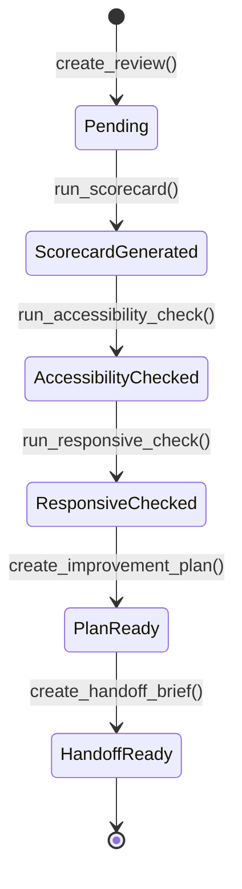

# GOAT Designer Agent

The **Designer Agent** is a core component of the GOAT Prime Agent tier. It acts as an elite UI/UX reviewer, critique partner, and planner. The Designer is not an automated CSS rewrite tool or an image generator; rather, it inspects your existing designs, provides thoughtful scorecards based on established UX heuristics, and builds structured improvement plans.

## Role & Responsibilities

- **UX Audits & Scoring**: Evaluates target interfaces (Dashboards, Landing Pages, Mobile Apps) on a strict 1-5 scale across Aesthetics, Usability, Performance, and Accessibility.
- **Accessibility Verification**: Ensures designs meet minimum WCAG contrast ratios, ARIA roles, and keyboard navigation standards.
- **Responsiveness Checks**: Identifies viewport breaking points and suggests mobile-first or responsive enhancements.
- **Builder Handoff**: Rather than executing code directly, the Designer produces structured Handoff Briefs containing clear specifications for the Builder Agent or a human developer.

## Core State Machine

The Designer operates on a state machine centered around a **Review**.

## Integration

The Designer integrates tightly with GOAT's broader ecosystem:
- **CLI Commands**: `/designer review <target>`, `/designer score`, `/designer plan`.
- **Aliases**: `@designer`, `@ui`, `@ux`
- **Dashboard**: A dedicated web view under `/designer` allowing users to manage active reviews, read detailed critiques, and generate reports.
- **Timeline Events**: Important actions (like handoff completion) emit `TimelineEvent`s to the global GOAT history.

## Safety & Default Status

Like all major GOAT capabilities, the Designer Agent is **disabled by default**. It must be explicitly engaged via CLI aliases, dashboard clicks, or API requests. It does not perform autonomous code edits without ApprovalGate intervention and is safe to fail.

## Data Storage

Designer interactions are stored locally:
`~/.local/share/goat/agents/prime/designer/reviews.jsonl`

This allows for seamless checkpointing, privacy preservation, and local-first operation.
